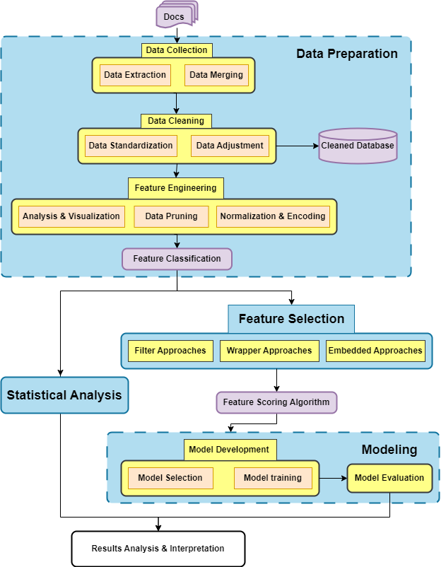

# ML-ReponsePrediction-LuPSMA-RIV2024
Documentation technique et explications de ma présentation au Congrès RIV 2024 à Lyon. Sujet : prédiction de la réponse à la thérapie $^{177}$Lu-PSMA pour le cancer de la prostate résistant à la castration métastatique, via des techniques d'apprentissage automatique.

## Changelog

- **v1.0.0** - 2024-06-18
  - Initial release.
  - Added data directory structure.
  - Implemented main scripts for data preparation, feature engineering, model training, and evaluation.
- **To be added**
  - main scripts of FeatureSelection.ipynb
  - **Un document explicatif complet devrait être mis à jour la semaine prochaine**

### Structure du Projet

La structure suivante présente l'organisation du projet, avec une brève description de chaque répertoire et fichier :

- **data/**: Répertoire pour les fichiers de données.
  - **raw/**: Contient les fichiers de données brutes.
  - **processed/**: Contient les fichiers de données traitées.
  - **external/**: Contient les fichiers de données externes, tels que les modèles pré-entraînés.

- **docs/**: Répertoire pour la documentation.

- **notebooks/**: Répertoire pour les notebooks Jupyter.
  - **DataPreparatoion.ipynb**:
  - **StatisticalAnalyses.ipynb**
  - **FeatureSelection.ipynb**
  - **Modeling.ipynb**

